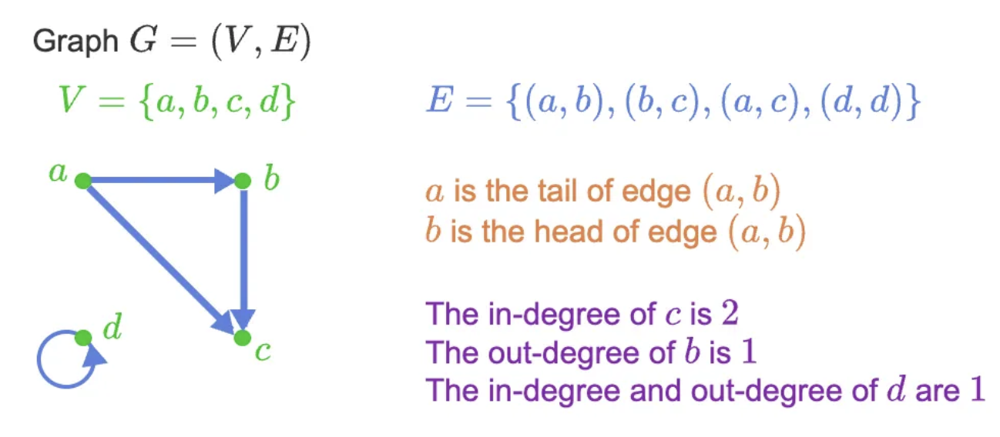

# Graphs
Before we get into graph traversal algorithms like the breadth-first-search, we need a brief introduction to graphs in discrete mathematics.
A graph is a way of **representing relationships** that **exists between pairs of objects**. Do NOT confuse graphs in this context to function plots, bar charts, etc. Those are different!

Abstractly, a graph $G = (V, E)$ is a set V of **_vertices_** (or nodes) and a set E of pairs of vertices from V called **_edges_** (or links), which fundamentally represents the relationship and connection between two vertices.

For example, $G = (V, E)$, where
* $V = \{ a,\ b,\ c, \ d \}$  
* $E = \{(a, b),\ (b, c),\ (a, c),\ (d, d) \}$

The elements of $V$ are our nodes/vertices, and the elements of E are edges/links.
These edges could be _**directed**_ or **_undirected_**

## Directed and Undirected Edges 
An edge is **_directed_** from $a$ to $b$ if the pair $(a, b)$ $\in$ $E$ is ordered, where $a$ precedes $b$ such that $(a,b) \neq (b,a )$. Simply put, the order matters.   

Otherwise, an edge is **_undirected_** if the pair $(a, b)$ is not ordered, so $(a, b)$ and $(b, a)$ could represent the same edge. 

An edge being directed or undirected depends entirely on the context and how the graph is defined.

All things considered, **graphs** can be a(n)git :  

* **_directed graph_**, also called a digraph, if all edges in the graph are directed.
* **_undirected graph_** if all edges in the graph are undirected.

_NOTE: Undirected edges are often written as {a, b}, but here a set of regular parenthesis () is used for simplicity._

## More Terminology and Properties
* Two vertices u and v that are joined by an edge are called _**endpoints**_
* Two vertices u and v are _**adjacent**_ if there is an edge between them, making the endpoints of that edge the vertices themselves.
* If an edge is directed, then the first endpoint is its _**origin**_ and the other endpoint is the **_destination_**
* An edge is **_incident_** on a vertex if the vertex is one of those edge's endpoints.

Incident and adjacent are two separate terms, even though they are similar. However, note that adjacency is a relationship between two vertices, and incidence is a relationship between an edge and a vertex. We say, for example, that edge $e$ is incident to vertex $v$, and, for adjacency, vertex $u$ and $v$ are adjacent.

